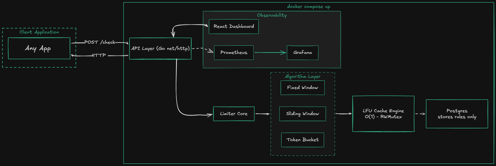
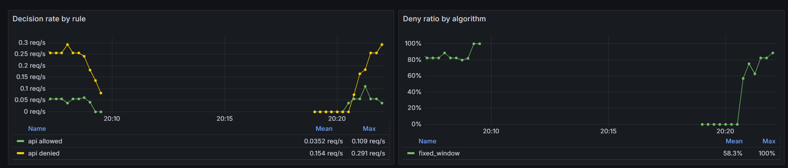
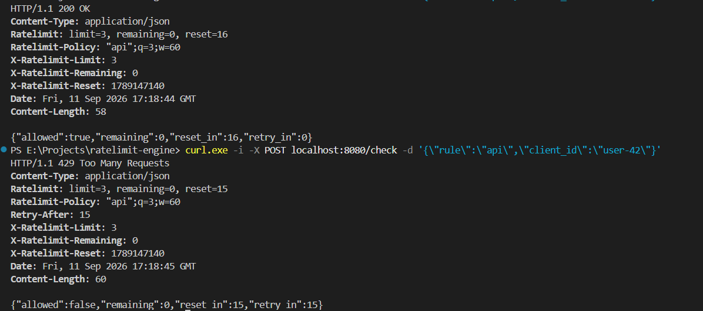
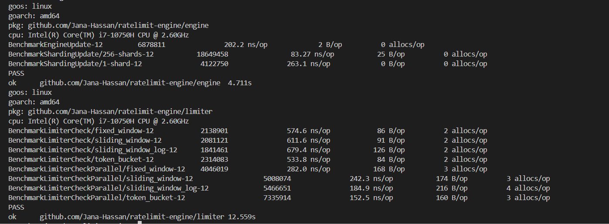
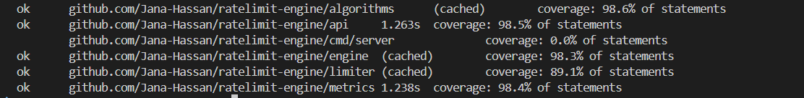

# Rate Limit Engine

## Overview

Rate Limit Engine is a rate-limiting service built from scratch in Go to protect APIs from excessive traffic.

It combines rate-limit algorithms, concurrent in-memory state, HTTP APIs, and observability. The cache, eviction policy, and all four algorithms are built from scratch.

It supports four algorithms behind one interface:

- fixed window
- weighted sliding window
- sliding-window log
- token bucket

---

## Architecture



```text
HTTP API
  -> Limiter
    -> selected Algorithm
      -> Engine.Update or Engine.View
    -> Recorder
```

- `api` validates HTTP requests, manages rules, returns rate-limit headers, and applies the probe limit to `HEAD /check`.
- `limiter` resolves a rule, selects an algorithm, builds the state key, and records decision latency.
- `algorithms` owns rate-limit state transitions.
- `engine` owns key storage, sharding, locking, hit/miss counters, and eviction.
- `metrics` exports Prometheus counters and histograms. The Compose deployment provisions a Grafana dashboard.
- `limiter.RuleRepository` separates rule storage from rule management.
- `FileRepository` persists rules with a temporary file, sync, close, and rename.

The main endpoints are:

| Method | Path | Behavior |
| --- | --- | --- |
| `POST` | `/check` | Consume quota and return JSON plus rate-limit headers |
| `HEAD` | `/check` | Read-only quota inspection, protected by a 60 requests per 60 seconds probe limit |
| `GET` | `/rules` | List rules |
| `POST` | `/rules` | Create or replace a rule |
| `DELETE` | `/rules/{name}` | Delete a rule |
| `GET` | `/healthz` | Health response |
| `GET` | `/stats` | Uptime, rule, cache, and decision statistics |
| `GET` | `/metrics` | Prometheus exposition format |

`HEAD /check` performs a read-only `Peek` and is separately protected by a 60-request-per-minute probe limit.

```text
POST /check  ->  Allow  ->  Engine.Update  (write lock, mutates)
HEAD /check  ->  Peek   ->  Engine.View    (read lock, no mutation)
```

An Allow-then-undo design cannot provide the same guarantee. Two concurrent probes could both increment and both undo, with no transaction boundary around the pair. The counter could drift below the truth. `Peek` reads through `Engine.View` and does not mutate state.

The `-trust-proxy` flag controls how the probe limiter identifies visitors.

**Before:** `clientIP` always used `RemoteAddr`. Behind Fly every visitor looks like the proxy, so the per-IP probe limit becomes one global limit.

**After:** `-trust-proxy=false` (default, local) uses `RemoteAddr` and ignores the header. `-trust-proxy=true` (behind Fly) trusts `Fly-Client-IP`, which Fly overwrites per request so it cannot be spoofed from outside.

Use `-trust-proxy=true` only when the service is behind a trusted Fly proxy.



---

## Algorithms

Every algorithm implements:

```go
Allow(key string, rule Rule) Result
Peek(key string, rule Rule) Result
```

| Algorithm | State and behavior | Trade-off |
| --- | --- | --- |
| Fixed window | Counter for an aligned time window | Small state and simple computation. A boundary can permit a 2x burst in a short interval |
| Sliding window | Current count plus weighted previous-window count | Smoother than fixed windows, but approximate |
| Sliding-window log | **Ring buffer** of request timestamps up to the rule limit | More exact rolling-window behavior. Memory grows with the per-key limit |
| Token bucket | Refilled fractional token count capped at the limit | Allows controlled bursts and gradual recovery |

Invalid limits or windows are denied before state is written. `Peek` uses `Engine.View`, so it does not mutate algorithm state or consume quota. `Sliding-window-log` peeking uses **binary search** over the ordered ring (`O(log n)` for the expired-prefix search).



---

## Design Decisions

### 1. Atomic `Update`, not separate `Get` and `Set`

An allow decision is a read-modify-write operation. Each algorithm runs its transition inside `Engine.Update`, which holds the selected shard lock while it reads the old value and stores the new value. This prevents the lost-update race that would occur if two requests performed `Get`, calculated independently, and then called `Set`.

`View` is reserved for read-only operations. It uses a read lock, while `Get`/`Update` use an exclusive lock because cache access also updates LFU frequency and recency state.

### 2. 256 shards instead of one global lock

Keys are hashed with FNV-1a into 256 shards. Each shard has its own maps, frequency lists, capacity, and `RWMutex`. Requests for unrelated keys can progress under different locks. Requests for the same key still serialize, which is required for correctness.

```text
BenchmarkShardingUpdate/256-shards     83.27 ns/op
BenchmarkShardingUpdate/1-shard       263.1 ns/op
```

The cost is more bookkeeping and per-shard capacity rather than one global capacity. A hot key remains a hot lock, and the engine is not a distributed coordination mechanism.

### 3. O(1) local LFU with LRU tie-breaking

```text
keyMap   "user:42" -> node
freqMap  1 -> [node] [node]     <- minFreq, evict from here
         2 -> [node]
         5 -> [node] [node]
```

Naive LFU scans every entry to find the least-used. Here `minFreq` points straight at the eviction candidate, so there is no scan. Within the least-used frequency, the least-recently-used entry is removed.

This gives bounded entries and **`O(1)`** map and list operations. It avoids one global lock and avoids a global ordering structure.

### 4. Catching bad rules at write time

The API checks positive limits and windows and uses `HasAlgorithm` before persisting a rule. Take a rule written as `"algorithm": "slyding_window"`.

**Without the guard:** the bad rule saves fine. Later a request checks that rule, the limiter looks for `"slyding_window"`, does not find it, and errors at check time while a real user is being blocked. Bad place to discover a typo.

**With the guard:** `POST /rules` checks the algorithm name exists before saving. The typo is rejected immediately with `"unknown algorithm"`. The bad rule is never stored.

Catch errors when the rule is written, not when a user hits it.

### 5. Unambiguous cache keys

Rate-limit state keys include the rule-name length and rule name before the client ID. Without the length prefix, `rule=login` with `client=alice:bob` and `rule=login:alice` with `client=bob` both produce `login:alice:bob`. The length prefix keeps these pairs separate.

### 6. Fixed-window boundary behavior

Fixed windows are aligned to Unix time boundaries. A client can use the full limit near the end of one window and again at the start of the next. The 2x boundary burst is an accepted fixed-window trade-off. Use sliding-window or token-bucket rules when boundary bursts are unacceptable.

---

## Benchmarks

Measured in a Linux container on an Intel Core i7-10750H, Go 1.24. These are microbenchmarks, not HTTP load-test results.

### Engine

```text
BenchmarkEngineUpdate                 202.2 ns/op     2 B/op   0 allocs/op
BenchmarkShardingUpdate/256-shards     83.27 ns/op   25 B/op   0 allocs/op
BenchmarkShardingUpdate/1-shard       263.1 ns/op     0 B/op   0 allocs/op
```

In the benchmark's spread workload, the 256-shard engine measured about **3.2x** the throughput of its one-shard comparison.

### Limiter checks

```text
BenchmarkLimiterCheck/fixed_window          574.6 ns/op    86 B/op   2 allocs/op
BenchmarkLimiterCheck/sliding_window        611.6 ns/op    91 B/op   2 allocs/op
BenchmarkLimiterCheck/sliding_window_log    679.4 ns/op   126 B/op   2 allocs/op
BenchmarkLimiterCheck/token_bucket          533.8 ns/op    84 B/op   2 allocs/op

BenchmarkLimiterCheckParallel/fixed_window        282.0 ns/op   168 B/op   3 allocs/op
BenchmarkLimiterCheckParallel/sliding_window      242.3 ns/op   174 B/op   3 allocs/op
BenchmarkLimiterCheckParallel/sliding_window_log  184.9 ns/op   216 B/op   4 allocs/op
BenchmarkLimiterCheckParallel/token_bucket        152.5 ns/op   160 B/op   3 allocs/op
```

The limiter benchmarks call Go methods directly. They do not include HTTP parsing, network I/O, or Prometheus scraping.



---

## Testing

```bash
go test ./...              # full suite
go test -cover ./...       # coverage
go test -race ./...        # race detector
go test -bench . ./...     # benchmarks
```

Coverage by package: `algorithms` 98.6%, `engine` 98.3%, `limiter` 89.1%. The `api` and `metrics` packages have no tests.

A shared contract suite runs all four algorithms through the same assertions, so a new algorithm inherits the same guarantees:

**Limits:** invalid rules denied before state is written, allowed up to the limit then denied, a denial stays denied for the window, concurrent `Allow` calls never exceed the limit.

**Peek:** does not mutate state or consume quota, predicts what the next `Allow` will decide, reports full quota on an unknown key.

**Safety:** keys are isolated from one another, corrupt cached state does not panic, `ResetIn` stays within the configured window.

CI runs three jobs on every push to `main` and `dev`:

1. Build, `go vet`, and `go test ./...`
2. `go test -race ./...` plus a parallel engine benchmark under the race detector
3. `docker build`



---

## Quick Start

**Requirements:**

- Go 1.24 or later
- Docker and Docker Compose

Run locally:

```bash
git clone https://github.com/Jana-Hassan/ratelimit-engine.git
cd ratelimit-engine
go test ./...
go run ./cmd/server -addr=:8080 -rules-file=rules.json
```

Create a rule:

```bash
curl -X POST http://localhost:8080/rules -H "Content-Type: application/json" -d '{"name":"api","limit":5,"window_sec":60,"algorithm":"token_bucket"}'
```

Check a client:

```bash
curl -X POST http://localhost:8080/check -H "Content-Type: application/json" -d '{"rule":"api","client_id":"user-123"}'
```

`POST /check` consumes quota. `HEAD /check?rule=api&client_id=user-123` returns headers without consuming quota.

Run the API with Prometheus and Grafana:

```bash
docker compose up --build
```

This exposes the API on `:8080`, Prometheus on `:9090`, and Grafana on `:3000`.

---

## Phase 2 and Future Work

Current scope and known gaps:

- Rate-limit state is local to one process.
- Rules use one local JSON file not a shared configuration store.
- The Compose Grafana setup enables anonymous viewer access for development.
- Sliding-window-log state is allocated according to the configured limit.
- There are no distributed-failure tests.
- Multiple replicas do not share counters or quotas.

Phase 2 priorities:

1. Authentication and authorization for rule management
2. Input, rule-count, and memory bounds
3. Reproducible HTTP load tests
4. Atomic state-store abstraction
5. Shared backend for multi-instance quotas
